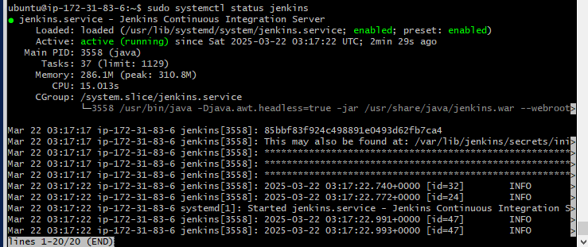
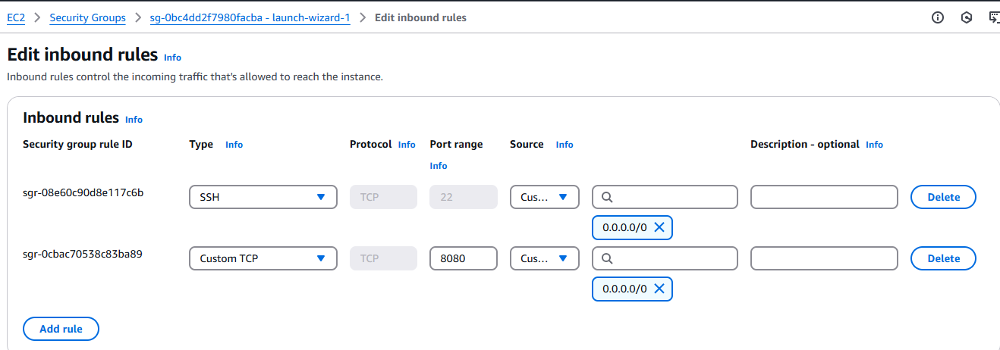
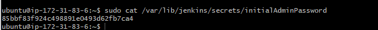
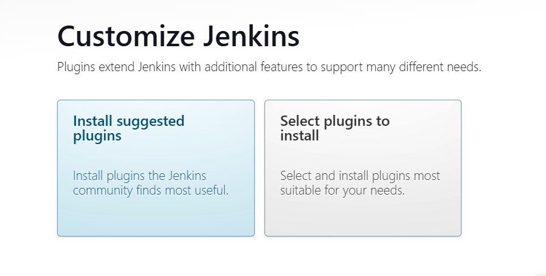
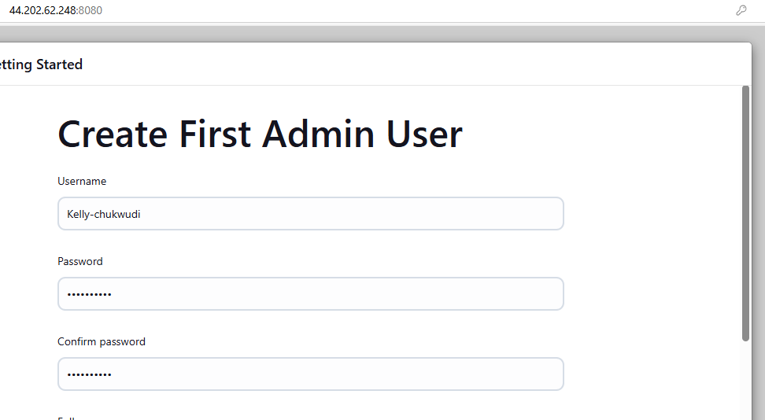
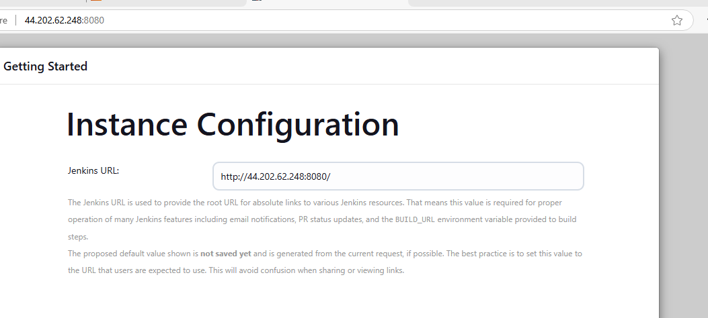
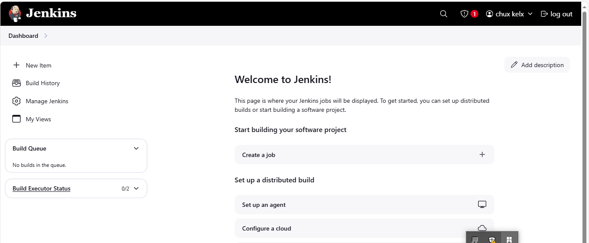

# Introduction-to-Jenkins


## Introduction to Jenkins

Jenkins is an open-source automation server used for continuous integration (CI) and continuous delivery (CD). It helps automate software development processes like building, testing, and deploying applications.
Jenkins has over 1,800+ plugins for integrating with tools like Git, Docker, Kubernetes, and Ansible

Getting started with Jenkins;

First, Update package repository

``` 
sudo apt update
```
Install java

``` 
sudo apt install default-jdk-headless
```
For Debian-based distributions, add the Jenkins repository and import the GPG key
```
  curl -fsSL https://pkg.jenkins.io/debian-stable/jenkins.io-2023.key | sudo tee \
    /usr/share/keyrings/jenkins-keyring.asc > /dev/null

  echo deb [signed-by=/usr/share/keyrings/jenkins-keyring.asc] \
    https://pkg.jenkins.io/debian-stable binary/ | sudo tee \
    /etc/apt/sources.list.d/jenkins.list > /dev/null
```
Update your package index and install Jenkins:

```   
sudo systemctl enable jenkins
  sudo systemctl start jenkins
```
Enable Jenkins to start on boot and initiate the service

```   
sudo systemctl enable jenkins
  sudo systemctl start jenkins
```
Confirm Jenkins has been install and its running

``` 
sudo systemctl status jenkins
```



By default, Jenkins listens on port 8080, create new inbound rules for port 8080 in security group


Access Jenkins: Jenkins will be accessible at http://localhost:8080.


The initialAdminPassword file is located a

```
/var/lib/jenkins/secrets/initialAdminPassword
```
you can retrieve the initial admin password using

sudo cat /var/lib/jenkins/secrets/initialAdminPassword


Install suggested plugins


Create a user account




Log into Jenkins console


This is Jenkins Dashboard.
The dashboard serves as the central hub for managing Jenkins projects and builds, providing an overview of build status, build history, and other relevant information. The "Welcome to Jenkins!" section on the dashboard guides users to set up distributed builds or start building a software project. From the dashboard, users can create new jobs, view build history, manage Jenkins settings, and monitor the build queue and executor status. 